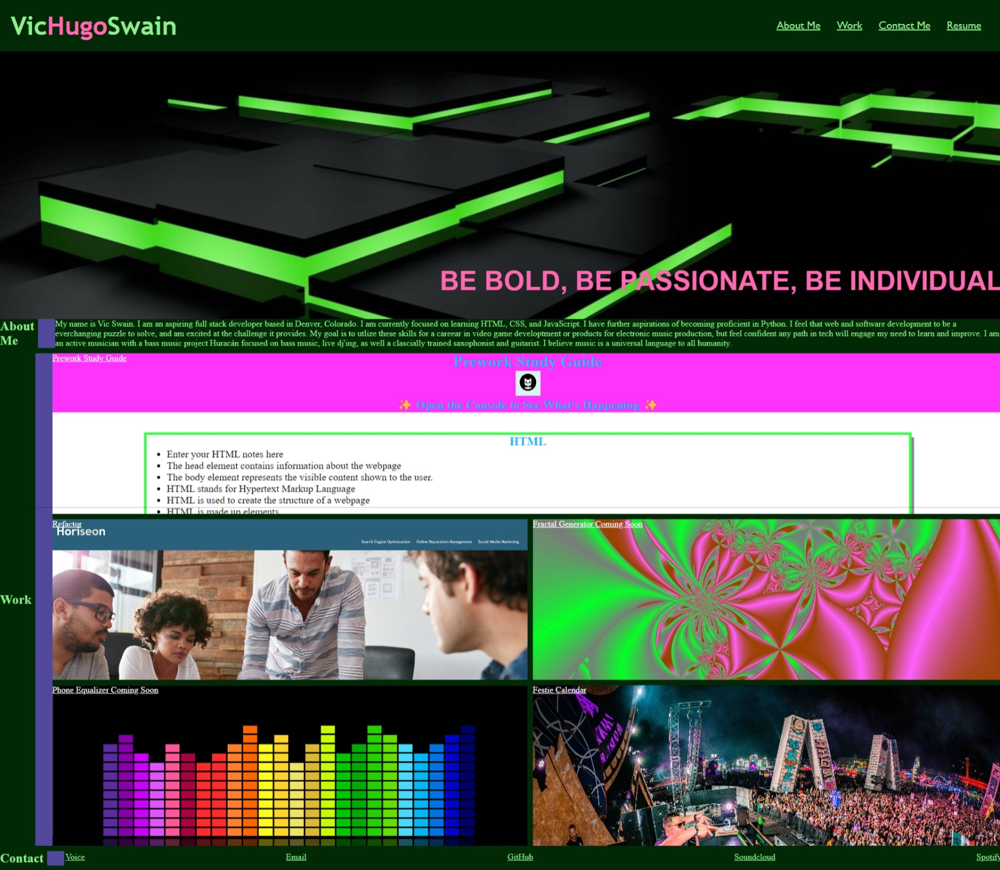

# Build a portfolio

## Purpose
I wanted to start building a live responsive portfilo to build upon as I start looking for employment as a full stack developer. I wanted to hone my skills on HTML for page structure, and CSS for styling. I focused on learning Flexbox and CSS Grid for the layout of this page. I wanted to ensure a color scheme that was appeling to look at but still showed "me" in the style. I had to overcome the placement of the gride that is the class workbox. The values for grid rows and columns was an area of troubleshooting and learning for me. I am still working to overcome the borderimage area to ensure it lines up going down the page. I also utilized CSS variable to refrain from DRY programming and media queries to ensure the page will work on all screens. 

### Credits
I pair programmed part of this with Noah Kagney and received guidance on CSS Grid from Maury Hughes
I used a CSS reset template Josh W Comeau

#### Screenshot

##### URL
https://vicswain.github.io/Module2Challenge/